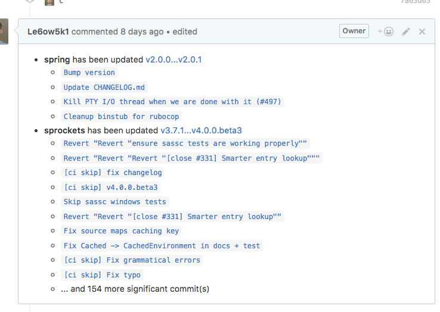

# greenhorn

Bot that checks github PR's for changed dependencies in Gemfile.lock.

It analyzes changes made to Gemfile.lock file, determines which dependencies have changed, and creates a comment with list of changelogs gathered from Github API.

## Development

You will need Docker and Docker-compose installed.

Copy config file:

    cp profiles.clj.example profiles.clj

Then specify config variables.

Then run migrations:

    docker-compose run --rm app lein migrate

To start a web server for the application, run:

    docker-compose up web

## Test

    docker-compose run --rm app lein test

## Roadmap

  - [x] Prettify comments
  - [x] Commits from gems diffs, possibly JIRA issues
  - [x] Filter out insignificant commits
  - [ ] Automatic updates of organization repos
  - [ ] Better error handling, especially in API calls
  - [ ] Smart truncating of large comments
  - [ ] Github authentication
  - [ ] Removing pull info on merge and close

## License

Copyright © 2016 Konstantin Lazarev
